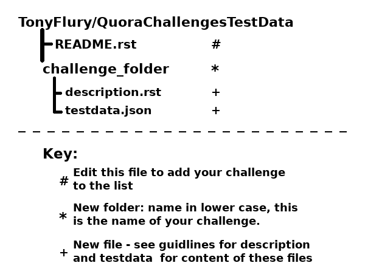

==========================
Developer Guide - Overview
==========================

 - :ref:`Introduction<Introduction>`
 - :ref:`Required Contents<RequiredContents>`
 - :ref:`Pre requisites<PreRequisites>`
 - :ref:`Process Overview<ProcessOverview>`
 - :ref:`Likely Audiences<Audiences>`
 - :ref:`Additional Information<AdditionalInfo>`

----

.. _Introduction:

Introduction
------------

This Developer Guide documents how experienced developers can set their own challenges for either `Python Beginners`_ or
`Python Programming`_ readers, such that the readers can use this framework to confirm that their code successfully
completes the challenge.

Every challenge will require the user to implement a single function, which takes one or more inputs (either positional or keyword or both)
and will return one or more values. As the person setting the challenge your role is the clearly described the requirements you expect the entrants
to meet, and define a set of test data that is sufficient to show that the entrants code meets the requirments.

.. _RequiredContents:

Required Contents
-----------------

In order to provide a programming challenge under this framework you will need to provide

    - description.rst  - An English language description of the challenge; a clear definition of the functionality
      expected formatted in `rST`_ structure. The description should state any exceptions that the code should raise.
      See :doc:`Description Guidelines<description>` for more information.
    - testdata.json - A json file that defines the data sets which will be passed to the function in order to confirm
      that the function meets the description. See :doc:`Test Data Guidelines<testdata>` for details on how to write this
      critical file. Note that errors in this file will be presented to the user during testing of their code, and those errors
      are likely to confuse challenge entrants.
    - An examplar solution to the challenge - this is not published but is required to :doc:`testi your challenge test data<testdata>`.

    Please read the documentation while developing this content.

.. _PreRequisites:

Pre requisites
--------------
    Apart from a good knowledge of Python, there is a short list of pre-requisites

    - You are a known contributor to either `Python Beginners`_ or `Python Programming`_ spaces on `Quora`_
    - You have git on your developement machine
    - you have an account on Git Hub - and are familiar with cloning, forking, branches and pull requests.

.. _ProcessOverview:

Process Overview
----------------
There is a simple 9 step process to provide your own challenges :

1. Create a GIT fork of `QuoraChallengesTestData`_ and clone that fork to your local computer.
2. Create a new developement branch in your local copy.
3. Create a new folder at the top level of the repository - the name of folder is the chosen name for the challenge. The
   folder name must be in lowercase.
4. Within the new folder create the following files :doc:`description.rst<description>`, :doc:`testdata.json<testdata>` and
   any optional files that your challenge requires.
5. Edit the Readme.rst in the top level directory to add your challenge to the list.
6. Write your exemplar solution, and test your solution and your testdata.
7. Once all of the requirements are complete, commit and push the branch to your git hub repository. Do not commit your exemplar solution.
8. Request a pull request to merge your branch into the main repository.
9. Once the merge has been completed - publicise your challenge in the appropriate space.

To make it clear - these are the changes and new files that are required in order to create a new challenge :

    File Changes required in the `QuoraChallengesTestData`_ repository.

.. warning::
    Please do not publicise your challenge until the merge is complete. Until the merge completes, the testdata and
    description will not be available to the public.

.. _Audiences:

Likely Audiences
----------------

When developing your challenge, please keep in mind at all times the target audience. The `Python Beginners`_ space is
intended for those developers who are just starting out with Python and likely just starting out with development. It is
likely that they wont be up to speed with most data structure and algorithms. Challenges aimed at the developers in
`Python Programming`_ (who generally have skill level intermediate and beyond) will be much less common and should be
more likely to admit more than one style of solution.

.. _AdditionalInfo:

Key Additional Information
--------------------------
Make sure you are familiar with these additional guidelines in order to complete your challenge.

    - :doc:`Writing your description <description>`
    - :doc:`Writing your test data <testdata>`
    - :doc:`Testing your challenge test data <testing_your_challenge>`

.. toctree::
    :hidden:

    description
    testdata
    testing_your_challenge

.. _Python Beginners : https://www.quora.com/q/python-beginners
.. _Python Programming : https://www.quora.com/q/python-programming
.. _QuoraChallengesTestData : https://github.com/TonyFlury/QuoraChallengesTestData
.. _rST : http://docutils.sourceforge.net/docs/ref/rst/restructuredtext.html
.. _Quora : https://www.quora.com/